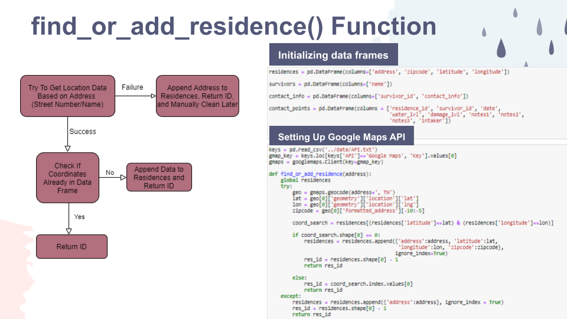

# Managing the Flood of Disaster Data

## Table of Contents
[Intro](https://github.com/holly-t-123/Disaster_Data#intro)

[Cleaning (Excel)](https://github.com/holly-t-123/Disaster_Data#cleaning)

[Transformation (Python)](https://github.com/holly-t-123/Disaster_Data#transformation)

[Dashboard (Tableau)](https://github.com/holly-t-123/Disaster_Data#dashboard)

#

## Intro

I worked with Hands On Nashville when they activated Disaster Response Mode for the March 2021 flooding in South Nashville. As part of the data team, I helped collect, process, and analyze the survivor data that came in from a number of different sources. The process was very manual and relied on a lot of copy-pasting between Excel spreadsheets. The end result was a 1700 row master spreadsheet of survivor data and a Google map with no filtering or interactivity options. I decided to revisit this data for my Data Analytics Capstone project to apply my new skills to increase both the efficiency and functionality of the analysis.
#

## Cleaning

The initial data was ten separate Excel spreadsheets collected from various government/relief organizations. Everyone collected slightly different data in slightly different ways. Below you can see the column headers copy-pasted from each file I was working with to get an idea of how varied they were...

The main hurdle at first was cleaning the 10 different data sets. Cleaning issues I had to solve included...

- No entry dates on most of the spreadsheets (Chose to give all entries the date that Hands On Nashville received the spreadsheet)
- Inconsistent address format (Pared everything down to Street Number, Street Name with no hyphens in apartments)
- PII in the comments (Scanned through to manually delete PII)
- Capitilization issues creating unnecessary categories (Simple replacement function)

Excel allowed me to make these cell-by-cell adjustments easily. I saved the results to CSV files to be used in the next step.
#
## Extract-Transform-Load (ETL) Process

Using Python, I wanted a way to extract the data into related tables that masked the PII with numbered IDs. In order to streamline the process, I built three functions that would take in whatever information was available (which differed between data sets), account for duplication, and return relevant IDs to be used in the main table. Then I could use a standard format for passing each data set into the functions, changing file names and column names as needed. All of this code can be found in the "Creating Schema" notebook. I have included screenshots below to illustrate the functions, the template I used to parse each of the 10 files, and the resulting ERD.

A few tools I used in this ETL process included...
- Pandas
- Google Maps API
- Geopandas and GEOJSON files
- difflib.get_close_matches()

#

## Dashboard

Finally, I imported my new data frames into Tableau to build a functional dashboard. The intended users are groups like the Office of Emergency Management (OEM) or Voluntary Organizations Active in Disasters (VOAD). I imagine them refreshing the data on a daily basis to get a real-time overview of the disaster's scope, so they can efficiently distribute resources where needed. No PII is included in the public dashboard; however, the Residence and Survivor IDs are included for authorized users to reference the relevant people and places to send aid. [The link to the public dashboard is here](https://public.tableau.com/app/profile/holliday.therrell/viz/DisasterData-March2021FloodSouthNashville/Dash), and I have added a picture below.

The dashboard includes...

- A satellite map of Nashville plots the coordinates of impacted residences as points
- Tooltips that provide additional details about each location when you click/hover on a point
- A treemap of damage classification that is color coordinated with the points on the map
- Filters for council district, days since last contacted, and damage classification that interact with both visualizations

